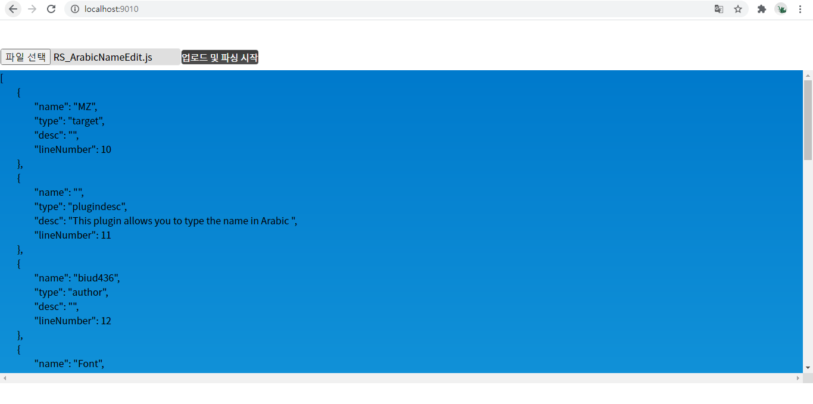

# Introduction
RPG Maker MZ의 플러그인 매개변수 데이터를 툴 없이 읽어낼 수 있는 파싱 도구입니다.

기본적으로는 웹에서 동작합니다.



파싱은 서버에서 진행됩니다.

따라서 Node.js를 설치한 후, 다음 명령을 명령 프롬프트에서 실행시켜주셔야 합니다. 

```bat
npm install -D
```

설치가 완료된 후, ```start-server.bat``` 파일을 실행하면 툴 페이지(localhost:9010)가 시작됩니다.

이후 업로드 및 파싱 시작 버튼을 누르면 파싱된 결과가 화면에 출력됩니다.